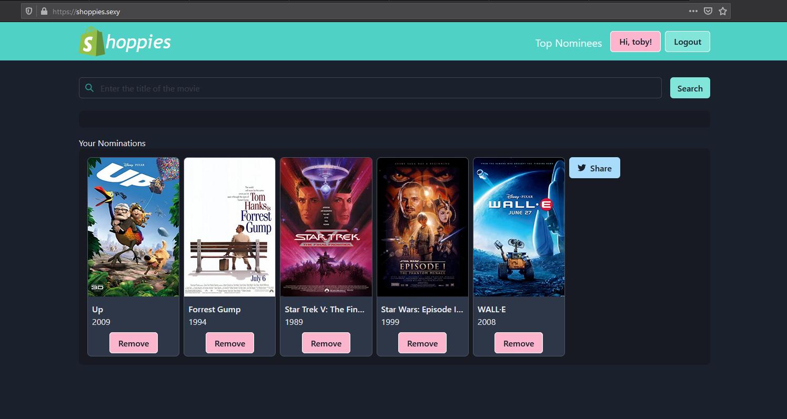
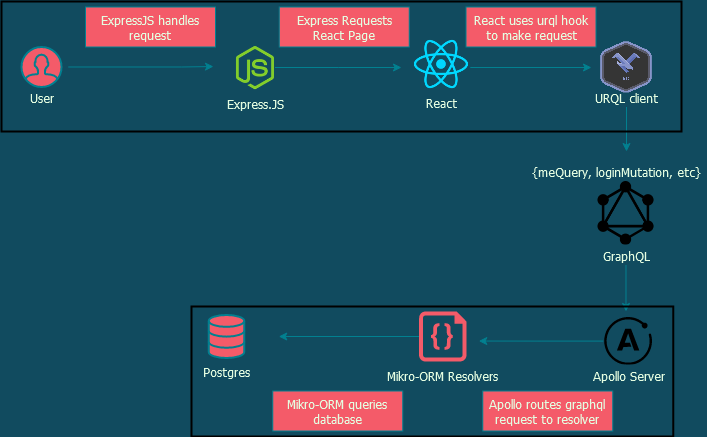

# [shoppies](https://shoppies.sexy) :fire:
Shopify Web Developer Project which allows users to make an account and nominate their favourite movies for the "Shoppies".



:heavy_check_mark: Users can share nominations to **Twitter** so that no one will think they have a bad taste in movies. \
:heavy_check_mark: Allows users to create accounts to persist their nominations to **PostgreSQL database** \
&emsp;&nbsp;&nbsp; through **GraphQL**. \
:heavy_check_mark: Features **Top Nominations page** to see what movies are currently ahead! \
:heavy_check_mark: Shout out to [omdbAPI](http://www.omdbapi.com/)

## GraphQL Request Architecture

	
## Technologies
Front end:
* TypeScript React
* Next.JS
* GraphQL 15.4.0
* Chakra-ui 0.3.9
* urql 1.11.4

Back end:
* TypeScript Node.JS
* Apollo-Express 2.19.1
* Mikro-orm 4.3.4
* PostgresQL 15
* Docker :whale:
	

```

```
